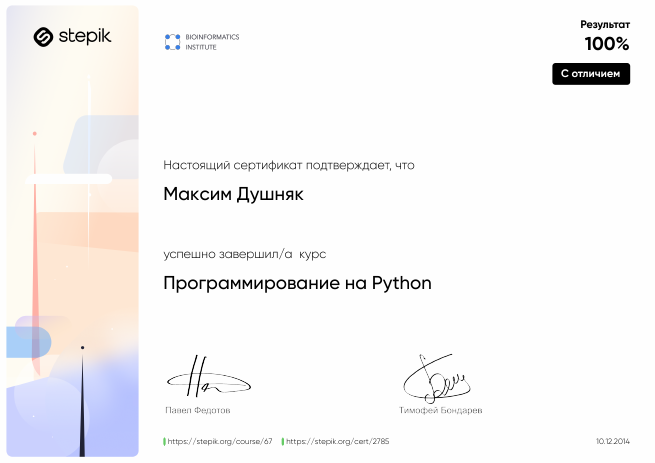

# Dushniak Maxim

## Contacts

* Location: Belarus
* E-mail: maxim.dushniak@gmail.com
* GitHub: [@maximdushniak](https://github.com/maximdushniak "https://github.com/maximdushniak")

## About me
A lot of time I'm working as 1С developer and now I want open smth new for myself.

## Skills
* 1C:Enterprice
* SQL
* Python
* JavaScript
* Windows OS, Linux(Ubuntu, CentOS)
* XML, JSON

## Education

* Stepick, online course **JavaScript for biginners**
[](https://stepik.org/cert/990822)

* Stepik, online course **Python: Basics and application**
[](https://stepik.org/cert/24827)

* Stepik, online course **Python programming**
[](https://stepik.org/cert/2785)

* Bachelor, Belarusian National Technical University, Minsk   
  * Specialty: Intelligent devices, machines, technologies and production

## Code example
```
function testRegExp(s, sub_s) {
    let myPattern = RegExp(sub_s,'g');
    let x = new Array();
    let myResult = myPattern.exec(s);
    while (myResult!= null) {
        x.push(myResult[0]);
        myResult = myPattern.exec(s);
    }
    return x.join(",");
}
```

## Language
English level - B1
